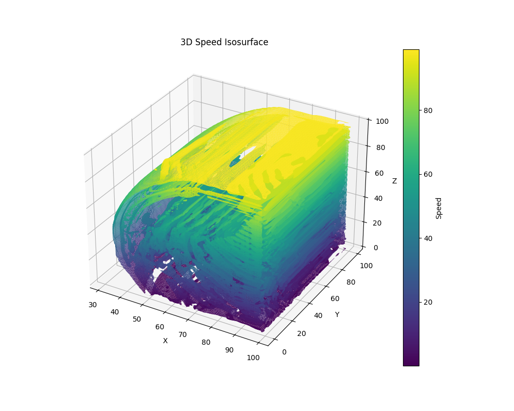

# Group 15: LBM

## Introduction

This project implements lattice Boltzmann method for lid-driven cavity problem with both 2D (D2Q9) and 3D (D3Q19) models. For the 2D model, we implemented both a serial version and a parallel version based on OpenMP. For the 3D model, we implemented a parallel version based on OpenMP and another parallel version based on CUDA.

## LBM implementation overview
1. **Initialization**:
   - The distribution function (`f`) is initialized based on equilibrium conditions.
   - Velocity and density fields are set to their initial values.

2. **Collision Step**:
   - The equilibrium distribution function is computed for each lattice point.
   - The collision process uses the BGK (Bhatnagar-Gross-Krook) approximation, where the distribution function is relaxed toward equilibrium based on a relaxation time parameter (`tau`).

3. **Streaming Step**:
   - Distribution functions are propagated to neighboring lattice nodes according to their discrete velocities.

4. **Boundary Conditions**:
   - **Top Boundary (Lid)**: A constant velocity is enforced to drive the flow.
   - **Stationary Walls**: Bounce-back rules are applied to ensure no-slip conditions.

5. **Output**:
   - Macroscopic quantities such as density (`ρ`) and velocity (`u_x, u_y`) are computed from the distribution function.
   - Results are saved as CSV files for visualization and further analysis.

## Prerequisites

- A modern C++ compiler that supports C++17 or later
- OpenMP
- Python 3.7+ with numpy, matplotlib, scikit-image and pandas
- Goodle colab (for CUDA execution)

## Install and complie

Git clone from GitHub:
```
git clone https://github.com/AMSC-24-25/15-lb-15-lb.git
cd 15-lb-15-lb
```

Complie:
```
make
```

Clean the compiled files and results:
```
make clean
```

## Running

Run the simulation:
```
./bin/lbm
```

Visualize the results:

1. For 2D simulation:
```
python print_image.py
```

2. For 3D simulation:
```
python print_image_3D.py
```

## File structure

The project is organized as follows:
```
15-lb-15-lb/
├── bin/                         # Compiled binaries and executables
├── build/                       # Intermediate build files
├── doc/                         # Documentation for the project
├── history/                     # Version history or previous results
├── include/                     # Header files for the project
│   ├── LBM_2D.hpp               # Class definition for the 2D Lattice Boltzmann Method
│   └── LBM_3D.hpp               # Class definition for the 3D Lattice Boltzmann Method
├── picture/                     # Store the visulize results.
├── result/                      # Store the simulation results.
├── src/                         # Source code files
│   ├── LBM_2D.cpp               # Implementation of the LBM_2D class defined in LBM_2D.hpp
│   ├── LBM_3D.cpp               # Implementation of the LBM_3D class defined in LBM_3D.hpp
│   └── lbm.cpp                  # Main entry point for running LBM simulations
├── .gitignore                   # Git ignore rules
├── Makefile                     # Build system configuration for compiling the project
├── README.md                    # Project description and instructions
├── print_image.py               # Python script for 2D visualization
├── print_image_3D.py            # Python script for 3D visualization
└── LBM implement by CUDA_v2.ipynb # Jupyter Notebook for CUDA-based LBM implementation

```

- **`LBM_2D.hpp`** Class definition for the 2D LBM
- **`LBM_3D.hpp`** Class definition for the 3D LBM
- **`LBM_2D.cpp`** Implementation of the LBM_2D class
- **`LBM_3D.cpp`** Implementation of the LBM_3D class
- **`lbm.cpp`** Main entry point for running LBM simulations

## Strong and weak scalability test

The table provides the execution times obtained on a computer with 8 cores and 16 threads. The simulation, conducted with a cavity size of 100 × 100, was executed for 10,000 iterations.

| Threads | Time (s) | Speedup | Efficiency |
|---------|----------|---------|------------|
| 1       | 37.132   | 1       | 1          |
| 2       | 20.864   | 1.78    | 0.89       |
| 3       | 15.822   | 2.347   | 0.782      |
| 4       | 14.624   | 2.539   | 0.635      |
| 5       | 13.074   | 2.84    | 0.568      |
| 6       | 12.797   | 2.902   | 0.484      |
| 7       | 12.479   | 2.976   | 0.425      |
| 8       | 12.161   | 3.053   | 0.382      |
| 9       | 11.768   | 3.155   | 0.351      |
| 10      | 13.716   | 2.707   | 0.271      |
| 11      | 13.091   | 2.836   | 0.258      |
| 12      | 10.687   | 3.475   | 0.29       |
| 13      | 9.13     | 4.067   | 0.313      |
| 14      | 6.948    | 5.344   | 0.382      |
| 15      | 6.937    | 5.353   | 0.357      |
| 16      | 6.99     | 5.312   | 0.332      |

The table presents the execution times measured on a computer equipped with 8 cores and 16 threads. The simulation was performed for 1000 iterations, with each thread processing 20,000 lattice points.

| Cavity Size | Threads | Time (s) | Efficiency |
|-------------|---------|----------|------------|
| 141x141     | 1       | 16.573   | 1          |
| 200x200     | 2       | 17.736   | 0.93       |
| 244x244     | 3       | 19.216   | 0.86       |
| 282x282     | 4       | 22.245   | 0.75       |
| 316x316     | 5       | 25.764   | 0.64       |
| 346x346     | 6       | 23.676   | 0.7        |
| 374x374     | 7       | 35.613   | 0.47       |
| 400x400     | 8       | 37.027   | 0.45       |
| 424x424     | 9       | 40.532   | 0.41       |
| 447x447     | 10      | 45.672   | 0.36       |
| 469x469     | 11      | 51.596   | 0.32       |
| 489x489     | 12      | 44.538   | 0.37       |
| 509x509     | 13      | 40.711   | 0.41       |
| 529x529     | 14      | 41.516   | 0.4        |
| 547x547     | 15      | 43.169   | 0.38       |
| 565x565     | 16      | 45.303   | 0.37       |

## Result

### The 2D simulation runs for 10,000 iterations


### The 3D simulation runs for 100 iterations


## CUDA version
This part of the project demonstrates an implementation of the Lattice Boltzmann Method using CUDA for parallelism. The notebook provides a detailed walkthrough of the algorithm, including CUDA kernel definitions and optimizations.

### Features
- LBM Simulation: Implements the Lattice Boltzmann Method for fluid dynamics simulation.
- CUDA Acceleration: Utilizes CUDA to perform parallel computations, significantly improving runtime efficiency.
- Optimized Code: Includes optimizations for memory access and kernel performance.

### How to use:
1.	open this .ipynb file in google colab
2.	execute first command “!pip install git+https://github.com/andreinechaev/nvcc4jupyter.git” to install the package
3.	execute second command “%load_ext nvcc4jupyter” to load the cuda package
4.	And there are 2 blocks of code, the first block is 2D LBM implementation and the 2nd piece of code is 3D LBM. Execute and change the parameter you want
5.	The answer shown is the result of the simulation(last round) 

### Output
Visualizations of the flow field during the simulation of final round.
